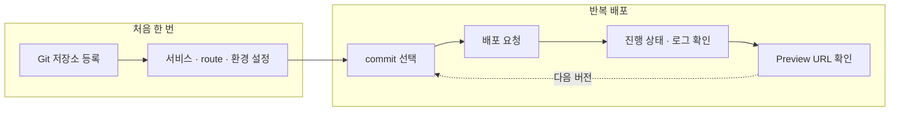
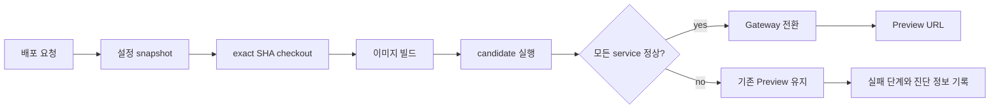
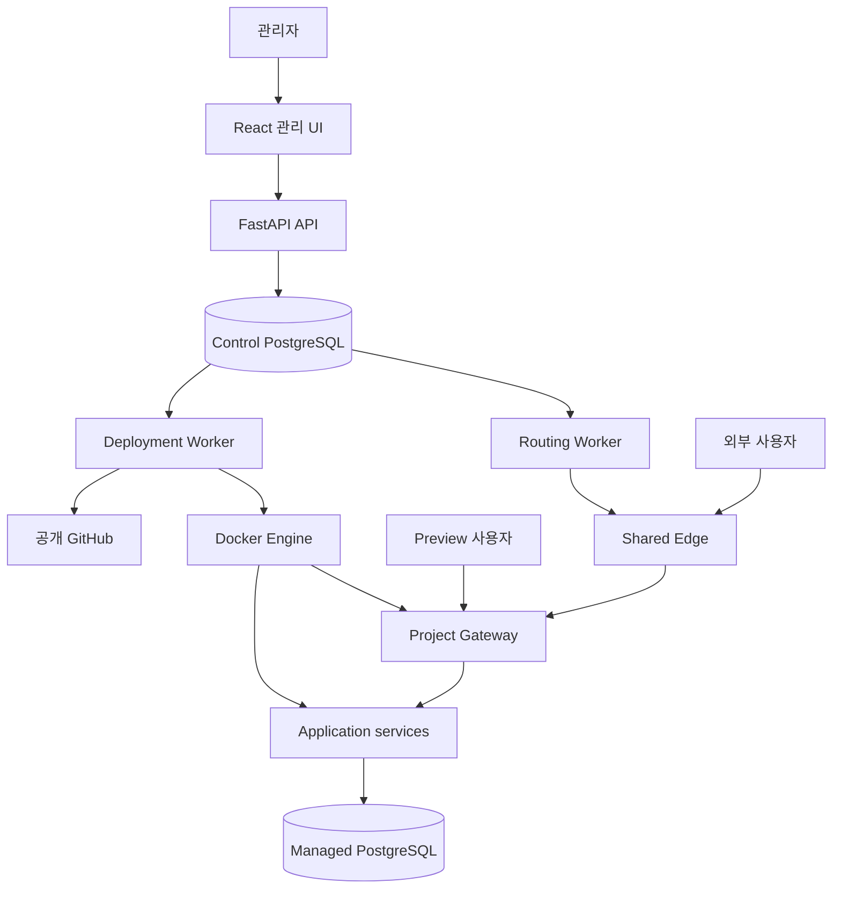

# Heimdall

> 반복적인 배포 과정을 하나의 요청으로 연결해 Preview 환경을 만드는 셀프 호스팅 배포 자동화 도구

Heimdall은 공개 GitHub 저장소의 애플리케이션을 가져와 Docker 이미지로 빌드하고, 실행 가능한지
확인한 뒤 안정적인 Preview URL과 설정한 프로젝트별 `hostname`으로 연결한다.

**현재 상태:** Alpha · 단일 Docker 호스트 · 공개 GitHub 저장소 · 단일 관리자

## 문제

애플리케이션을 배포할 때마다 같은 작업을 반복해야 했다.

```text
소스 준비
-> 서비스별 이미지 빌드
-> 환경변수와 secret 연결
-> network와 container 실행
-> 동작 확인
-> reverse proxy와 접근 주소 연결
```

각 작업은 한 번만 보면 단순하지만, 새 버전을 배포하거나 Preview 환경을 다시 만들 때마다 같은
순서로 수행해야 했다. 이 반복은 배포에 필요한 시간을 늘렸고, 여러 서비스와 설정을 매번 빠뜨리지
않고 맞추는 일도 번거롭게 만들었다.

## 해결

Git 저장소와 서비스 구성을 한 번 등록한 뒤 배포할 `commit`을 선택하면, 소스 준비부터 Preview
연결까지 이어지는 과정을 Heimdall이 수행하도록 만들었다.

| 반복 작업               | Heimdall이 수행하는 일                                              |
| ----------------------- | ------------------------------------------------------------------- |
| 배포할 소스 준비        | 허용된 `main` 이력의 정확한 commit SHA checkout                     |
| 서비스별 실행 환경 구성 | Docker 이미지 빌드, 환경변수·secret 주입                            |
| 여러 서비스 실행        | generation network와 candidate container 생성                       |
| 배포 결과 확인          | 서비스별 health check                                               |
| 접근 경로 변경          | Project Gateway 검증 후 새 generation 연결                          |
| 결과 공유               | 배포가 바뀌어도 유지되는 Preview URL과 설정한 project hostname 제공 |

프로젝트 설정은 Heimdall에 저장되므로 같은 프로젝트를 다시 배포할 때 이 과정을 처음부터 조립할
필요가 없다. 사용자는 최신 또는 최근 `main`의 `commit`을 선택하고 배포를 요청하면 된다.

## 결과

동일한 구성으로 다시 배포할 때 사용자는 `commit`을 선택하고 하나의 배포 요청을 보낸다. Heimdall은
위에서 구분한 여섯 종류의 작업을 이어서 수행하고, 배포가 끝나면 바로 확인할 수 있는 Preview URL을
제공한다. 다음 배포에서도 기존 설정과 접근 주소를 이어서 사용하므로 반복 배포에 필요한 수작업의
범위를 줄였다.

배포 시간이나 단축률은 실행 환경에 따른 실제 측정값을 확보하기 전까지 성과로 표기하지 않았다.
현재 README에서는 코드와 동작으로 확인할 수 있는 **자동화 범위**만 결과로 다룬다.

## 사용자 실행 흐름

저장소와 서비스 구성은 처음 한 번 등록한다. 이후 새 버전을 배포할 때는 저장된 설정을 다시 사용해
`commit` 선택부터 Preview 확인까지의 흐름을 반복한다.



### 배포 요청 뒤 Heimdall이 하는 일

사용자가 배포를 요청하면 다음 과정이 자동으로 이어진다.



## 자동화를 구현하며 내린 기술적 판단

아래 설계는 프로젝트의 출발점이 아니라, 반복 작업을 자동화한 뒤 그 자동화를 실제로 사용할 수
있게 만들면서 추가한 판단이다.

### 자동화가 잘못된 배포까지 빠르게 만들지 않게 한다

새 버전을 기존 서비스에 바로 연결하지 않고 별도의 candidate generation으로 실행한다. 모든
서비스의 health check가 성공한 뒤에만 Project Gateway를 전환한다. 빌드, 실행, 검증 또는 전환이
실패하면 새 candidate를 노출하지 않고 마지막 정상 Preview를 유지한다.

### 요청 순간의 배포 조건을 끝까지 보존한다

배포 요청 시 프로젝트 설정을 변경 불가능한 snapshot으로 저장하고 정확한 commit SHA를 사용한다.
배포가 진행되는 동안 프로젝트 설정이나 `main`의 최신 `commit`이 바뀌어도, 어떤 소스와 설정으로
실행했는지 설명할 수 있다.

긴 빌드와 container 작업은 HTTP 요청 안에서 처리하지 않는다. API는 DB에 보존되는 job을 기록하고,
Deployment Worker가 claim token과 lease를 사용해 작업을 수행한다. Worker가 중단되면 새 Worker가
DB, Docker와 NGINX 상태를 다시 확인한 뒤 이어서 처리한다.

### 배포 버전과 접근 주소의 생명주기를 분리한다

애플리케이션 container는 배포마다 바뀌지만 프로젝트별 Gateway는 고정 Preview port를 유지한다.
Shared Edge도 application container가 아니라 Gateway만 바라본다. 덕분에 새 generation으로 전환할
때 Preview 주소와 공개 routing 구성을 매번 새로 만들지 않아도 된다.

### 실패 뒤에 다음 행동을 결정할 수 있게 한다

배포 단계와 event를 구조화해 저장하고 진행 상황은 SSE로 전달한다. 서비스 로그와 실패 진단 정보는
크기와 보존 기간을 제한하며, Heimdall이 알고 있는 secret을 마스킹할 수 없으면 원문을 반환하지
않는다. 단순히 `FAILED`만 남기는 대신 어느 단계에서 무엇을 확인해야 하는지 알 수 있게 했다.

## 아키텍처



- **Control Plane:** UI, API, 두 Worker와 Control PostgreSQL이 프로젝트 설정과 배포 작업을 관리한다.
- **Project Runtime:** Project Gateway와 application container가 실제 요청을 처리한다.
- **요청 경로:** 이미 적용된 외부 요청은 API나 Worker를 거치지 않는다. Control Plane이 잠시
  중단돼도 Edge와 Project Runtime이 살아 있다면 기존 Preview와 공개 경로는 유지된다.
- **데이터베이스:** Heimdall의 운영 상태를 저장하는 Control PostgreSQL과 프로젝트의 application data를
  저장하는 Managed PostgreSQL의 생명주기를 분리했다.

상세한 네트워크 경계와 구성요소별 책임은
[아키텍처 문서](project-docs/architecture.md)에서 확인할 수 있다.

## 현재 구현 범위

- HTTPS 공개 GitHub 저장소 등록과 고정 `main` 브랜치 검증
- 여러 서비스의 Dockerfile 빌드와 서비스 간 private network
- path 기반 route, 서비스별 health check, plain·secret 환경변수
- 프로젝트별 Managed PostgreSQL 데이터베이스와 role
- `main`의 최신 또는 최근 `commit`을 선택하는 수동 배포 요청
- 배포 상태·이력·구조화 event SSE·서비스 로그·실패 진단 정보
- 안정적인 호스트 loopback Preview URL과 프로젝트별 HTTP 공개 hostname
- 실패 candidate 보존과 runtime reconciliation
- 고정 `admin` 로그인, signed cookie와 session-bound CSRF
- 정확한 resource identity를 확인하는 비동기 프로젝트 삭제

## 의도적으로 제한한 범위

Heimdall은 범용 PaaS나 managed SaaS가 아니다. 현재 운영 환경에서 반복 배포를 줄이는 데 필요한
범위를 먼저 구현했다.

- 단일 Docker 호스트와 한 명의 고정 관리자
- 공개 GitHub 저장소와 `main` 브랜치만 지원
- 배포는 사용자가 요청하며 webhook 기반 자동 배포는 지원하지 않음
- Kubernetes, 다중 노드 스케줄링과 자동 failover는 지원하지 않음
- private Git, image registry rollback과 custom domain은 지원하지 않음
- 외부 DNS, TLS certificate, public reverse proxy와 private tunnel은 운영자가 관리

전체 포함·비범위는 [제품 범위 문서](project-docs/product-scope.md)에 정리돼 있다.

## 기술 스택

| 영역      | 기술                                                         |
| --------- | ------------------------------------------------------------ |
| Backend   | Python 3.13, FastAPI, Pydantic, psycopg                      |
| Frontend  | React, TypeScript, React Router, TanStack Query, CSS Modules |
| 상태 저장 | Control PostgreSQL, 외부 Managed PostgreSQL                  |
| 실행 환경 | Docker CLI, NGINX Project Gateway, shared NGINX Edge         |
| 인프라    | Docker Compose                                               |
| 검증      | pytest, Ruff, Vitest, Testing Library, Playwright            |

정확한 dependency version은 `backend/pyproject.toml`, `frontend/package.json`과 lockfile이 관리한다.

## 저장소 구조

```text
backend/       FastAPI API, deployment·routing Worker, runtime adapter
frontend/      React 관리 UI
infra/         Control Plane과 Shared Edge Compose
doc/           처음 보는 운영자를 위한 쉬운 설명서
project-docs/  제품 범위, 아키텍처 계약과 기술 결정
```

## 실행과 문서

이 저장소의 Compose는 범용 one-click 설치 도구가 아니라 단일 호스트 기준 환경을 개발하고
검증하기 위한 구성이다. Edge, Managed PostgreSQL과 Control Plane은 서로 다른 생명주기로 실행하며,
DNS와 TLS를 포함한 외부 운영 환경은 별도로 준비해야 한다.

- [처음 보는 운영자를 위한 사용자 가이드](doc/README.md)
- [배포 요청 뒤의 실행 흐름](doc/02-execution-flow.md)
- [저장소와 코드 구조](doc/03-repository-structure.md)
- [데이터와 생명주기](doc/04-data-and-lifecycle.md)
- [로컬 실행과 장애 대응](doc/05-operations.md)
- [정확한 아키텍처 계약](project-docs/architecture.md)

개발 검증은 변경 영역에 따라 다음 명령을 사용한다.

```bash
# Backend
cd backend
.venv/bin/ruff format --check .
.venv/bin/ruff check .
.venv/bin/pytest

# Frontend
cd ../frontend
pnpm verify
```
