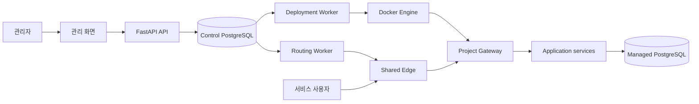
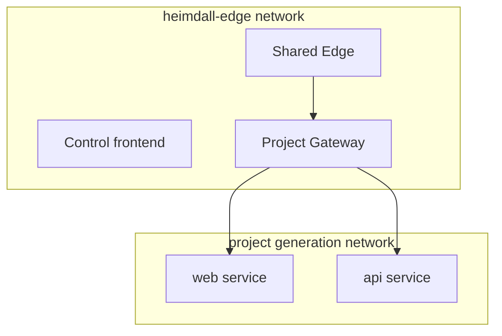

# 1. 전체 아키텍처

## 먼저 큰 그림

Heimdall 전체는 "관리하는 쪽"과 "실제 서비스하는 쪽"으로 나누면 이해하기 쉽다.



- 왼쪽의 UI, API, Worker, Control DB는 Control Plane이다.
- 오른쪽의 Edge, Project Gateway, application service는 사용자 요청을 처리하는 Data Plane이다.
- Managed PostgreSQL은 Control DB와 분리된 프로젝트 데이터 저장소다.

## 구성요소별 역할

### 관리 화면과 Control frontend

React로 만든 관리자 화면이다. 프로젝트 등록, 서비스 설정, 환경변수, DB, 배포, public hostname,
로그와 상태를 보여준다. 빌드 결과는 Control frontend NGINX가 제공한다. `/api` 요청은 이 NGINX를
통해 FastAPI API로 전달된다.

관리 화면은 편의를 위한 UI이고 최종 보안 경계는 Backend다. 화면 주소를 직접 우회해도 Backend가
관리자 세션과 CSRF를 다시 검사한다.

### FastAPI API

API는 요청을 접수하고 검증한다. 긴 Docker build나 Git checkout을 API 요청 안에서 직접 실행하지
않는다. 대신 Control DB에 "해야 할 작업"을 durable job으로 남긴다.

예를 들어 배포 버튼을 누르면 API는 다음을 한다.

1. 프로젝트와 commit을 확인한다.
2. 그 순간의 설정을 deployment snapshot으로 복사한다.
3. deployment와 deployment job을 DB에 기록한다.
4. 브라우저에는 접수 결과를 돌려준다.

실제 build와 컨테이너 교체는 Deployment Worker가 수행한다.

### Control PostgreSQL

Heimdall의 운영 장부다. 다음 정보의 최종 원본이다.

- 프로젝트와 현재 편집 가능한 설정
- 배포 요청 당시의 불변 snapshot
- 배포 상태와 작업 queue
- 현재 active runtime 정보
- public hostname의 원하는 상태와 실제 적용 상태
- 구조화 event와 실패 진단 artifact
- Managed DB의 metadata와 secret reference

애플리케이션의 게시글, 사용자, 주문 같은 실제 업무 데이터는 저장하지 않는다.

### Deployment Worker

배포를 실제로 수행하는 백그라운드 프로세스다. Docker socket과 Git workspace에 접근할 수 있다.

주요 책임은 다음과 같다.

- Control DB에서 다음 배포 작업 claim
- 정확한 Git commit checkout
- 서비스별 Docker image build
- generation network와 candidate container 생성
- 각 서비스 health check
- Project Gateway를 새 generation으로 전환
- 성공 상태 기록과 이전 generation 정리
- 실패 로그와 진단자료 수집
- 중간에 죽은 작업 복구와 runtime reconciliation

### Routing Worker

public hostname을 Shared Edge에 반영하는 프로세스다. Deployment Worker와 역할이 다르다.

- Deployment Worker: 프로젝트의 새 버전을 만든다.
- Routing Worker: hostname이 어느 Project Gateway로 갈지 반영한다.

Routing Worker는 전체 Edge 설정을 만들고 `nginx -t`로 검사한 뒤 원자적으로 교체하고 reload한다.
reload 뒤 management hostname과 project hostname을 실제로 probe한 후에만 applied 상태를 기록한다.

### Docker Engine

실제 실행 환경이다. Heimdall은 Docker CLI를 통해 다음 resource를 만든다.

- service image
- candidate와 active application container
- generation별 private Docker network
- 프로젝트별 Project Gateway container
- 공용 `heimdall-edge` network 연결

API와 application container에는 Docker socket을 주지 않는다. Docker를 조작해야 하는 두 Worker만
socket을 받는다.

### Project Gateway

프로젝트마다 하나씩 존재하는 NGINX다. 배포 generation마다 새로 하나씩 만드는 것이 아니라,
프로젝트의 안정적인 입구 역할을 유지한다.

```text
Project A Gateway -> 현재 Generation 1

새 배포 검사 중:
Project A Gateway -> 계속 Generation 1
Candidate Generation 2 -> 별도 health 검사

검사 성공 후:
Project A Gateway -> Generation 2
```

Project Gateway 덕분에 Preview 포트와 public hostname의 목적지는 배포가 바뀌어도 안정적이다.

### Shared Edge

Runtime VM에 하나만 존재하는 공용 NGINX다. HTTP 요청의 `Host`를 보고 목적지를 고른다.

```text
관리 hostname   -> Control frontend
프로젝트 hostname -> 해당 Project Gateway
알 수 없는 hostname -> 404
```

Shared Edge는 application container를 직접 가리키지 않는다. 따라서 일반 프로젝트 배포 때 전역 Edge
설정을 reload할 필요가 없고, 한 프로젝트의 실패가 다른 프로젝트의 routing에 미치는 영향이 줄어든다.

### Managed PostgreSQL

프로젝트 애플리케이션 데이터를 저장하는 별도 PostgreSQL cluster 또는 VM이다. Control PostgreSQL과
수명주기와 데이터 책임이 완전히 다르다.

DB 사용을 선택한 service만 다음과 같은 정보를 받는다.

- `DATABASE_HOST`, `DATABASE_PORT`
- project별 database, role, schema
- password 원문이 아니라 password file 경로

## 세 가지 요청 경로

### 관리 요청

```text
관리자 브라우저
-> 외부 TLS/reverse proxy
-> Shared Edge
-> Control frontend
-> /api 요청은 FastAPI API
-> Control PostgreSQL
```

### 프로젝트 public 요청

```text
사용자 브라우저
-> Cloudflare DNS/TLS와 운영자 reverse proxy
-> private tunnel 또는 운영 network
-> Shared Edge
-> Project Gateway
-> active application service
```

Cloudflare, 외부 TLS, public reverse proxy와 private tunnel은 현재 운영 환경의 구성요소이며 이
저장소가 자동으로 만들거나 관리하지 않는다.

### Preview 요청

```text
운영자
-> host 127.0.0.1:<프로젝트별 고정 포트>
-> Project Gateway:8080
-> active application service
```

Preview는 host loopback에만 열리므로 기본적으로 외부 사용자를 위한 주소가 아니다.

## Docker network 구조



application container는 `heimdall-edge`에 직접 참여하지 않는다. Project Gateway만 Edge network와
현재 generation network 양쪽을 연결한다.

## NGINX가 여러 개인 이유

| NGINX                  |                   개수 | 역할                                            |
| ---------------------- | ---------------------: | ----------------------------------------------- |
| Shared Edge            |       Runtime VM당 1개 | hostname 기준 전역 분기                         |
| Project Gateway        |  배포된 프로젝트당 1개 | route 기준 service 분기와 generation 전환       |
| Control frontend NGINX | Control frontend당 1개 | React 정적 파일 제공과 `/api` proxy             |
| 외부 reverse proxy     |  운영 환경에 따라 별도 | TLS 종료와 private network 연결, 저장소 밖 책임 |

## 단일 장애 지점

현재 목표는 단일 Runtime VM이다. Shared Edge와 Docker daemon, VM 자체에 자동 failover가 없다.
Project Gateway 구조는 프로젝트 사이의 배포 실패를 격리하지만 VM 장애까지 해결하지는 않는다.
