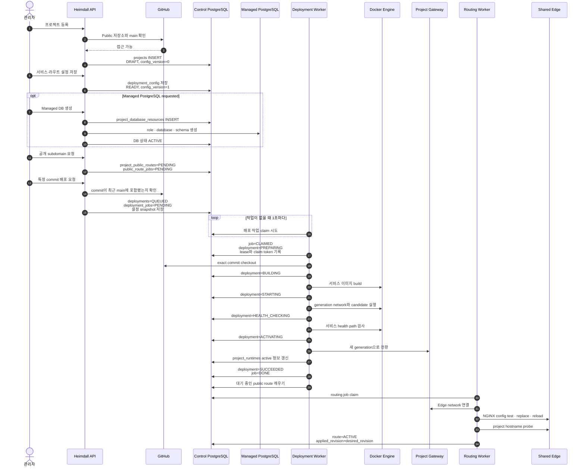

# Architecture

## Architecture at a Glance

Heimdall preserves the existing per-project Preview gateway and adds one shared Edge NGINX so the
same deployed application can be reached through both a stable loopback Preview URL and a public
hostname.

For a quick operational reading, start with [Why Keep One Gateway per Project?](#why-keep-one-gateway-per-project),
[Port and address contract](#port-and-address-contract),
[What causes an NGINX change?](#what-causes-an-nginx-change), and
[Failure and Restart Boundaries](#failure-and-restart-boundaries). The later sections preserve the
consistency, recovery, security, and code-ownership contracts used by the implementation.

### Before: Preview only

```text
Operator
  -> Docker host publish at http://127.0.0.1:<stable-preview-port>
  -> mapped to Project Gateway NGINX:8080
  -> Active deployment generation
```

Each deployed project already had one stable Project Gateway NGINX. The host published a
project-specific loopback port to that gateway, and the gateway selected the active application
generation.

### Now: Preview and public hostname

```text
Preview path — unchanged

Operator
  -> Docker host publish at http://127.0.0.1:<stable-preview-port>
  -> mapped to Project Gateway NGINX:8080
  -> Active deployment generation

Public path — added

Browser
  -> http://<label>.<deployment-base-domain>
  -> Wildcard DNS
  -> Single OCI Runtime VM
  -> Shared Edge NGINX
     host bind: configurable
     container listener: 80
  -> heimdall-edge Docker network
  -> Project Gateway alias:8080
  -> Active deployment generation
```

The public route does **not** forward to the Preview host port. Preview and public traffic use
different entry paths and converge on the same Project Gateway. The Edge never targets an
application container or a generation alias directly.

Public project hostnames are currently unauthenticated HTTP endpoints. Any client that can reach an
applied hostname can access it.

### What changed

| Area                  | Before                                        | Current architecture                                        |
| --------------------- | --------------------------------------------- | ----------------------------------------------------------- |
| Preview               | Stable loopback port                          | Unchanged                                                   |
| Public ingress        | None                                          | One shared Edge NGINX per Runtime VM                        |
| Project gateway       | One stable NGINX gateway per deployed project | Preserved                                                   |
| Deployment switching  | Project Gateway selects the active generation | Unchanged                                                   |
| Public hostname state | None                                          | API, Control PostgreSQL, durable job, and Routing Worker    |
| Edge routing          | None                                          | Exact hostname to deterministic Project Gateway alias       |
| Checked-in TLS        | Not implemented                               | Admin needs operator HTTPS; repository TLS remains external |

### The three NGINX roles

| NGINX role             |                                        Count | Responsibility                                                                                          |
| ---------------------- | -------------------------------------------: | ------------------------------------------------------------------------------------------------------- |
| Shared Edge NGINX      |                           One per Runtime VM | Accepts management and project hostnames and dispatches by exact `Host`                                 |
| Project Gateway NGINX  | One per deployed project, not per generation | Owns the stable Preview endpoint and switches that project between deployment generations               |
| Control frontend NGINX |                 One Control frontend service | Serves the React build, proxies `/api`, and disables SSE buffering; it is not a project routing gateway |

The Routing Worker is not another proxy. It is a control-plane process that writes, validates,
reloads, probes, and reconciles Edge configuration. It never handles user traffic.

## Why Keep One Gateway per Project?

Application containers and generation networks are replaceable. The Project Gateway provides a
stable project identity across those replacements.

```text
Before a new application deployment

Shared Edge -> Project A Gateway -> Generation 1

While Generation 2 is being prepared

Shared Edge -> Project A Gateway
                            +-- Generation 1 — active
                            `-- Generation 2 — candidate, checked separately

After Generation 2 activation

Shared Edge -> Project A Gateway -> Generation 2
```

At the proxy layer, a normal application deployment changes only the Project Gateway configuration.
It does **not** require a shared Edge configuration change or reload. Generation networks,
containers, runtime metadata, and cleanup state still change under the Deployment Worker. This keeps
one project's deployment and rollback out of the global ingress configuration.

Without the Project Gateway, the shared Edge would need to know every application's generation ID,
container alias, internal port, route table, activation state, and rollback target. A deployment of
one project would then mutate the global Edge configuration and expand its failure radius.

The additional gateway container per project costs memory and lifecycle management, but provides:

- a stable Preview port and deterministic Docker identity;
- project-local route and service selection;
- candidate validation before activation;
- atomic generation switching and last-known-good rollback;
- an Edge upstream that remains stable across ordinary deployments; and
- failure isolation between projects.

## Physical Topology and Network Boundaries

The current production target is one OCI Runtime VM with no OCI Load Balancer. The shared Edge is
the VM's public ingress and therefore remains a single-VM failure domain. The existing
operator-managed front Edge terminates HTTPS for the management hostname, while the checked-in Edge
configuration continues to own only the HTTP routing contract. Certificate operations and Edge TLS
configuration are outside this repository. Adding the Edge does not provide VM failover.

The management hostname and deployment wildcard domain are different domains. The operator points
both the exact management DNS record and the deployment wildcard DNS record at the Runtime VM's
fixed public IP. Wildcard DNS only delivers traffic to the VM; it does not authorize every
subdomain. The Edge routes only exact hostnames present in the applied route snapshot and returns
`404` for every other hostname.

```text
Single OCI Runtime VM
|
+-- Shared Edge NGINX
|   +-- exact management hostname -> Control frontend
|   +-- exact project hostname    -> Project Gateway
|   `-- unknown hostname          -> 404
|
+-- Control plane
|   +-- Control PostgreSQL
|   +-- FastAPI API
|   +-- Deployment Worker
|   +-- Routing Worker
|   `-- Control frontend NGINX
|
`-- Project runtimes
    +-- Project A Gateway -> Project A generation network
    +-- Project B Gateway -> Project B generation network
    `-- Project C Gateway -> Project C generation network

External Managed PostgreSQL VM
`-- private TCP endpoint for projects that enable database access
```

The fixed `heimdall-edge` Docker network contains only:

- the shared Edge NGINX;
- the Control frontend, under the fixed `heimdall-control-frontend` alias; and
- per-project gateways, each under a deterministic project alias.

Application containers remain on private generation networks. They do not join `heimdall-edge`.
The Edge therefore cannot route directly to an application container.

### Port and address contract

| Endpoint                             | Contract                                                                      |
| ------------------------------------ | ----------------------------------------------------------------------------- |
| Edge container listener              | Fixed `80/tcp`                                                                |
| Default local Edge host bind         | `127.0.0.1:8088`                                                              |
| Production Edge host bind            | Explicitly configurable public address and port                               |
| Project Gateway listener             | Fixed `8080/tcp`                                                              |
| Preview host endpoint                | Stable project-specific port bound to `127.0.0.1`, mapped to Gateway `8080`   |
| Edge project upstream                | Deterministic Project Gateway Docker alias at `:8080`; never the Preview port |
| Edge management upstream             | `heimdall-control-frontend:80`                                                |
| Project Gateway application upstream | Service generation alias and the service's declared internal port             |

Heimdall does not silently adopt a changed Preview port. The stored port is part of
`project_runtimes`; gateway recreation requests that same port, and a conflicting observation fails
with a stable runtime error. A Preview host-port issue does not rewrite the Edge configuration.

An application service-port change is applied by regenerating the Project Gateway configuration.
The Edge upstream remains the fixed Gateway alias at `:8080`. Changing the Gateway's internal
`8080` contract would require a coordinated Edge and runtime change and is not dynamically
supported.

### What causes an NGINX change?

The table describes a successfully validated and applied change. A request rejected before config
replacement does not reload the shared Edge.

| Event                                   |                     Shared Edge reload |                                        Project Gateway change |
| --------------------------------------- | -------------------------------------: | ------------------------------------------------------------: |
| Normal application deployment           |                                     No |                                                           Yes |
| Application internal-port change        |                                     No |                                                           Yes |
| Preview host-port conflict              |                                     No | Recovery or failure; the stored port is not silently replaced |
| Public hostname add, rename, or disable |                                    Yes |                                                    Usually no |
| Routing startup reconciliation          | May reload the canonical Edge snapshot |                            May ensure Edge-network attachment |
| Application generation rollback         |                                     No |                                                           Yes |

## Project Data Plane

The data plane consists only of proxies and deployed project resources. The API, Control
PostgreSQL, Deployment Worker, and Routing Worker are not part of an already-applied project request
path.

### Preview request

```text
Operator
  -> 127.0.0.1:<stable-preview-port>
  -> Project Gateway:8080
  -> active service in the deployment generation
```

### Public project request

```text
Browser
  -> exact project hostname
  -> Shared Edge NGINX
  -> deterministic Project Gateway alias:8080
  -> active service in the deployment generation
```

The API prevents malformed, reserved, and wrong-base-domain routes from entering desired state. The
Edge contains only exact applied hostnames, preserves the inbound `Host`, overwrites forwarding
headers at the trusted Edge hop, and sends every unmatched `Host` to the default `404` server.

### Application database request

```text
Application with projectDatabaseAccess=true
  -> private TCP endpoint
  -> Managed PostgreSQL VM
```

The Managed PostgreSQL container or VM does not join a generation network. Only opted-in services
receive its non-secret endpoint variables and password-file reference.

## Control Plane

For deployment and public routing, the API stores desired state and durable work. The Deployment and
Routing Workers claim that work and own the related Docker and NGINX effects.

### Control-plane access path

```text
Administrator
  -> https://<exact-management-hostname>
  -> operator-managed TLS at the existing front Edge
  -> Shared Edge NGINX
  -> Control frontend NGINX
  -> FastAPI API for /api requests
  -> Control PostgreSQL
```

If the Control frontend is unavailable, the management hostname fails while already-applied
project hostnames continue through the Edge to their Project Gateways.

### Administrator authentication boundary

The Backend authenticates exactly one fixed account named `admin`. It uses no user/session tables,
database migration, signup flow, user management, RBAC, or password-recovery workflow. These routes
form the authentication contract:

```text
POST /api/auth/login
GET  /api/auth/session
POST /api/auth/logout
```

`/api/health` and the authentication entry points are outside the protected management router. Login
verifies the owner-only Argon2id hash and establishes the session. Session lookup requires a valid
cookie, and logout requires both that session and its exact `X-CSRF-Token`. All project, deployment,
runtime, database, public-route management, diagnostic, log, and SSE routes are default-deny behind
the shared admin dependency. Safe authenticated `GET` requests need no CSRF header; authenticated
`POST`, `PUT`, `PATCH`, and `DELETE` requests do.

Starlette signs the eight-hour session cookie with the file-backed signing key. By default and in
production, it is named `__Host-heimdall-session` and is `Secure`, `HttpOnly`, host-only,
`SameSite=Strict`, and scoped to `/`. Explicit `HEIMDALL_AUTH_COOKIE_SECURE=false` instead selects
`heimdall-local-session` without `Secure` solely for loopback HTTP development; all other cookie
properties remain unchanged, and the browser must use one consistent hostname. API configuration
rejects this mode unless the management hostname ends in `.localhost`. The local cookie uses a
purpose-derived signing key distinct from the raw key used for the production cookie, so a signed
value cannot cross modes by changing only its cookie name. The complete payload is the fixed
username, absolute expiry, session-bound CSRF token, and credential revision; it contains no
password, password hash, or signing key. Expiry, signature tampering, a different signing key, or a
credential revision derived from a different password hash invalidates the session. Authentication
responses are not cacheable.

The frontend `/login` route is public, but the rest of the management route tree is nested under
`RequireAdmin`. The provider resolves `/api/auth/session` before rendering management data,
distinguishes `401` from API unavailability, restores the original internal deep link after login,
and exposes logout in the shared shell. The API client keeps the CSRF token in memory, sends
same-origin credentials, adds the header to unsafe methods, and clears auth state and the entire
protected query cache on `401`. It does not persist password, session, or CSRF data in browser
Web Storage: the signed cookie remains browser-managed, while the returned session payload and CSRF
token remain outside `localStorage` and `sessionStorage`. EventSource uses the same-origin host-only
cookie for authenticated SSE handshakes. Because native EventSource does not expose an HTTP status,
either stream's connection error triggers one deduplicated session lookup; its `401` enters the same
auth-state and query-cache cleanup path, while a network or `503` failure preserves the session.

This boundary protects the management UI and API only. Public project hostnames and loopback Preview
URLs remain unauthenticated. Because the cookie is host-only and the management hostname is outside
the deployment base domain, it is not sent to project hostnames.

### Deployment workflow

```text
Management UI
  -> FastAPI API
  -> immutable deployment snapshot + durable deployment job
  -> Deployment Worker claim token and lease
  -> exact Git checkout
  -> Docker generation candidate
  -> health and route checks
  -> Project Gateway activation
  -> active runtime metadata
  -> previous generation cleanup
```

The Deployment Worker owns generation creation, Project Gateway activation, rollback, and
preservation of the deterministic Edge alias whenever the gateway is created, rebased, restored, or
recreated.

#### End-to-end example: registration to public route

The following sequence uses a two-service project with an optional Managed PostgreSQL database and
a public hostname. It shows the durable Control PostgreSQL writes separately from Git, Docker,
Managed PostgreSQL, Project Gateway, and Shared Edge effects.



`projects.deployment_config` is the latest editable aggregate. A deployment request copies it and
its version into immutable `deployments.config_snapshot`, so later project edits cannot alter an
in-flight or historical deployment. Candidate images, containers, and networks exist in Docker;
only successful activation updates `project_runtimes.active_*`. Raw secret values remain in
owner-only files, Control PostgreSQL stores their references, versions, and fingerprints, and
application rows remain exclusively in Managed PostgreSQL.

### Public hostname workflow

```text
Project detail UI
  -> FastAPI API
  -> desired public route + durable routing job
  -> Routing Worker claim token, lease, and desired-revision fence
  -> ENABLED: exact Edge network and Project Gateway validation and attachment
     DISABLED: remove the project route without requiring a running Gateway
  -> canonical full Edge configuration
  -> nginx -t
  -> atomic replace and exact Edge reload
  -> management and project hostname probes
  -> applied public-route state
```

For enabled routes, the Routing Worker owns existing-gateway Edge attachment. For enabled and
disabled routes, it owns Edge configuration generation, testing, reload, probes, and startup
reconciliation. It does not create deployment generations or select an active application directly.

API, Deployment Worker, and Routing Worker use the same Python package and Backend image but run as
separate commands. Only the two Workers receive the Docker socket:

- Deployment Worker: generation and Project Gateway effects;
- Routing Worker: Edge network and Edge configuration effects.

The API, frontend, and application containers never receive the Docker socket. The Routing Worker
environment is limited to the Control DB and Edge/routing settings; it excludes Managed DB
provisioner credentials, Git workspace settings, and service-log settings.

Routers translate HTTP and resolve dependencies only. Feature services own validation and state
transitions, repositories own their feature tables, and dedicated adapters own external effects.
Docker, network, and NGINX effects remain in `runtime`; Git effects remain in `git/client.py`;
project-secret filesystem effects remain in `secrets/store.py`; and administrator secret
initialization and loading remain in `auth/secrets.py`. External commands use validated argument
lists rather than shell command strings.

Every Docker mutation requires deterministic identity and the resource-appropriate exact label set:
managed and kind for shared Edge resources; managed, project, and kind for a Project Gateway; and
managed, project, deployment, and type-specific identity for generation resources. A name match alone
never authorizes mutation.

Because the API and both Workers can start concurrently, schema migration is serialized with a
PostgreSQL advisory transaction lock.

## Lifecycle and Compose Ownership

```text
Edge lifecycle — infra/edge/compose.yaml
+-- Shared Edge NGINX
+-- fixed heimdall-edge network
`-- owner-only generated configuration root

Control lifecycle — infra/dev/compose.yaml
+-- Control PostgreSQL
+-- FastAPI API
|   `-- API-only read-only authentication secret bind
+-- Deployment Worker
+-- Routing Worker
`-- Control frontend NGINX

Project runtime lifecycle
+-- stable Project Gateway
`-- generation networks, containers, and images

Managed database lifecycle — ../heimdall-managed-db/compose.yaml
+-- Managed PostgreSQL
`-- dedicated named volume
```

`infra/edge/compose.yaml` owns the Edge container and fixed network under the
`heimdall-python-edge` Compose project. The Edge uses `unless-stopped`, owns the only configurable
public HTTP listener, serves the exact management route, and defaults unknown hostnames to `404`.
The Routing Worker writes the generated public-route snapshot into an owner-only host directory;
the Edge mounts that directory read-only. Static management configuration is rendered separately
into container tmpfs.

`infra/dev/compose.yaml` owns the Control PostgreSQL, API, both Workers, and frontend under the
`heimdall-python-local` project. Docker Desktop uses that base file directly. Ubuntu Docker Engine
also applies `infra/dev/compose.linux.yaml`, which moves only the Deployment and Routing Workers to
the host network and replaces their Control DB and host probe endpoints with loopback addresses.
The frontend joins both the Control network and the external `heimdall-edge` network. Control
Compose neither owns nor removes the Edge container, Edge network, or deployed project runtimes.

Before Control Compose starts, the host-side `heimdall-admin-init` command creates a new `0700`
authentication directory outside the repository containing `0600` `admin-password.hash` and
`session-signing.key` files. It prompts twice through `getpass`, rejects symlink path components, and
refuses a target inside a Git worktree or an existing directory. Control Compose mounts the selected
host directory read-only at `/run/secrets/heimdall/auth` in the API only and passes that container
path as `HEIMDALL_AUTH_SECRET_ROOT`. It also derives the non-secret
`HEIMDALL_AUTH_SECRET_SOURCE_ROOT` API metadata from the same host source; no second `.env` setting is
required. Control Compose also passes `HEIMDALL_AUTH_COOKIE_SECURE` to the API only, defaulting to
`true`; an explicit `false` selects the loopback-only HTTP development cookie mode and API startup
rejects it unless `HEIMDALL_MANAGEMENT_HOSTNAME` ends in `.localhost`. API startup also rejects
direct lexical equality or containment between the auth source and the runtime root, Git workspace
root, or Edge config root. The initialized path must remain canonical and non-symlink because Docker
dereferences a host bind-source symlink before the container can inspect it. The
deployment Worker, Routing Worker, frontend, Edge, Managed DB, and application containers receive
neither auth key nor the mount. The password, hash, and signing key are absent from Compose
environment values and Docker inspect environment; mount metadata contains paths only.

The Managed PostgreSQL lifecycle and volume are separate. Control and Managed DB Compose projects
do not share a Docker network; they communicate only through the configured TCP endpoint.

Runtime and Git workspace absolute host paths are bind-mounted into the Deployment Worker at the
same paths so the host Docker daemon can resolve them. The Routing Worker receives only its Edge
configuration root and Docker socket. Owner-only service-log broker sockets use the separate
`broker-sockets` named volume.

Local Control and Edge listeners default to `127.0.0.1`. On Docker Desktop, the Compose Deployment
Worker probes candidate health and stable Preview endpoints through `host.docker.internal`, and the
Routing Worker uses the same host path for the Edge listener. On Ubuntu Docker Engine,
`host.docker.internal` resolves to a bridge gateway that cannot reach host loopback-only listeners.
The Linux override therefore runs both Workers in the host network and uses `127.0.0.1` for their
Control DB and probe endpoints without widening any published port. Host-run processes also default
to `127.0.0.1`. This override does not make a loopback-only Managed PostgreSQL publish reachable from
bridge application containers. DB-enabled projects on Ubuntu must use an explicitly reachable
private endpoint. Docker Desktop defaults to `host.docker.internal:55433`; production uses a private
name such as `managed-db.internal:5432`, with the firewall limited to the current combined
Control/Runtime VM.

Control `stop` or `down` does not remove Edge or project runtime resources. Control Compose
`down -v` removes its `control-postgres` and ephemeral `broker-sockets` named volumes. Managed DB
Compose `down -v` removes its own PostgreSQL volume. Both commands are reserved for an explicit data
or environment reset.

## Failure and Restart Boundaries

| Failure              | Existing public routes                                                        | Preview                         | New work                                                                      |
| -------------------- | ----------------------------------------------------------------------------- | ------------------------------- | ----------------------------------------------------------------------------- |
| FastAPI API          | Continue                                                                      | Continue                        | Management requests unavailable                                               |
| Routing Worker       | Continue with the last applied Edge config                                    | Continue                        | Hostname changes wait                                                         |
| Deployment Worker    | Continue                                                                      | Continue                        | Deployments, runtime reconciliation, and service-log brokers stop             |
| Control PostgreSQL   | Continue                                                                      | Continue                        | API and both durable queues cannot read or change state                       |
| Control frontend     | Project routes continue                                                       | Continue                        | Management UI unavailable                                                     |
| Shared Edge NGINX    | All public hostnames fail                                                     | Continue                        | Edge restart policy handles process recovery                                  |
| One Project Gateway  | Only that project fails                                                       | That project's Preview fails    | Gateway recovery required                                                     |
| Candidate generation | Continue through the last-known-good active generation                        | Continue                        | Deployment rollback preserves active state and cleans only the safe candidate |
| Active generation    | That project's route may fail while the container restarts or is reconciled   | That project's Preview may fail | Restart policy and runtime reconciliation observe the active state            |
| Managed PostgreSQL   | Edge and Control lifecycles continue; DB-backed application behavior may fail | Same                            | Managed DB recovery required                                                  |
| Runtime VM           | All services on the VM fail                                                   | Fails                           | No VM-level failover is implemented                                           |

Successful project services, Project Gateways, and the Edge use `unless-stopped`. Control-plane
failure therefore does not remove their running data path. The restart policy recovers container
processes, not VM availability.

## Public Route Data Contract

`project_public_routes` stores one server-derived hostname per project. The client submits only a
subdomain label, and the Backend appends the configured deployment base domain. Validation covers
lowercase ASCII, label length, leading and trailing hyphens, repeated separators, and reserved
labels. Both desired and still-applied hostnames participate in conflict protection.

- `desired_revision` identifies the requested state.
- `applied_revision` identifies the revision confirmed at the Edge.
- nullable `applied_hostname` identifies the hostname the Edge actually serves.

A rename, disable request, or failed route-application attempt preserves the previous
`applied_hostname` until the replacement or removal succeeds. Another project cannot claim a
hostname that remains applied. `DELETE` records a disabled desired state; it does not immediately
delete the row.

An identical request is idempotent while pending, applying, or active. Repeating a failed or
uncertain route-application request requeues the same desired revision instead of inventing a new
one.

The state machines are explicit:

- desired state: `ENABLED | DISABLED`;
- public-route status: `PENDING | APPLYING | ACTIVE | INACTIVE | FAILED | UNCERTAIN`; and
- routing-job state: `PENDING | CLAIMED | SUCCEEDED | FAILED`.

Ordinary retryable failures use bounded backoff and converge to `FAILED` at the configured attempt
ceiling. An uncertain external result converges to `UNCERTAIN`. For an enabled route, a missing or
stopped Gateway is the intentional exception: the route remains `PENDING` under capped backoff until
an exact-project wake-up or timer retry. A disable claim does not require a running Gateway and can
remove the public route while that Gateway is unavailable.

`public_route_jobs` contains one delivery row per project with claim token, lease, attempt count,
and desired revision. Claim, renew, complete, retry, and failure transitions fence on both token and
revision. An expired claim may be recovered under a new token, and the old Worker can no longer
finalize it.

An enabled route waiting for a missing or stopped gateway remains pending with bounded backoff. A
successful deployment or active-runtime reconciliation wakes only that exact project's current
`GATEWAY_START_FAILED` job. Callback failure never rolls back a successful deployment; the bounded
timer remains the fallback.

## Edge Configuration and Reload Invariants

Public routing uses one bounded, deterministic, hostname-sorted full snapshot rather than
independent per-route files. The candidate consists of durable `applied_hostname` rows plus only the
current claim's proposed change to its own project slot. Raw desired rows that have never been
applied do not become reachable accidentally.

The Routing Worker captures the applied snapshot and renders the bounded candidate in memory. Under
the owner-only config lock, it fences that snapshot before testing, fences it again before writing
the transaction journal and replacing the current config, and fences it a final time after probes
but before DB finalization. A stale claim cannot finalize or remain as the applied state. Staleness
detected before switching leaves the current config untouched; staleness detected after switching
restores and re-probes the previous config before the claim is requeued with
`ROUTING_SNAPSHOT_CHANGED`.

The application sequence is:

1. For an enabled claim, validate and attach the exact-label Project Gateway. A disabled claim skips
   Gateway readiness. Capture the applied snapshot and render the complete candidate in memory.
2. Acquire the owner-only configuration lock and validate any interrupted transaction journal.
3. Fence the snapshot and verify the exact Edge network and Edge container.
4. Write a private temporary candidate and run `nginx -t` with the real Edge main config, rendered
   management config, and complete candidate route config, using the configured fixed NGINX image on
   the exact validated Edge network.
5. Fence again, capture the previous config, and write and fsync the `PREPARED` transaction journal.
6. Atomically replace and fsync the generated route file, reload only the exact managed Edge, and
   probe the management hostname and affected project hostnames.
7. Fence and finalize only if the claim token, desired revision, lease, and full applied snapshot
   still match; then mark the journal `COMMITTED` and remove it durably.

Configuration-test failure happens before replacement and leaves the current route file untouched.
Post-switch reload or probe failure, and definite claim rejection after a switch, restore and
re-probe the last-known-good config. A public-route failure never deletes the project's deployment
generation or database.

### Crash journal and ambiguous DB finalization

Before candidate replacement, the Routing Worker atomically writes owner-only
`.routing-transaction.json` with `previous`, `candidate`, `previous_hostname`, and the `PREPARED`
phase, then fsyncs both file and directory. After DB finalization it records `COMMITTED` before
deleting the journal.

The journal phase alone is never treated as proof of PostgreSQL commit state. On startup, DB-free
recovery only locks the configuration and verifies that the current file matches either the journal
previous or candidate value. It does not guess, reload, roll back, or delete a valid candidate while
the DB is unavailable.

After the DB opens, startup reconciliation rebuilds, tests, reloads, and probes the canonical full
configuration from the applied DB snapshot. An unrelated current config is preserved as a possible
operator change, automatic recovery is refused, and no new claim runs until canonical
reconciliation succeeds.

A definite DB claim rejection restores the previous config. A finalization error whose PostgreSQL
commit result is unknown preserves the candidate and `PREPARED` journal, records
`EDGE_FINALIZE_UNCERTAIN` when possible, and waits for canonical reconciliation:

- a real commit failure converges to the previous snapshot;
- a successful commit with a lost acknowledgement converges to the candidate snapshot; and
- only an unprovable restoration state remains `UNCERTAIN`.

## Deployment and Runtime Generation Contracts

### Deployment state and claim fencing

```text
QUEUED -> PREPARING -> BUILDING -> STARTING -> HEALTH_CHECKING
                                                |
                                                +-> ACTIVATING -> SUCCEEDED
                                                `-> FAILED
```

A project has at most one non-terminal deployment. The PostgreSQL job row owns delivery and lease;
the deployment row is the product-state source of truth.

Every claim receives a new UUID token. State transitions, lease renewal, retries, and terminal
writes require both Worker ID and token to match the current row. A new Worker can recover an
expired `CLAIMED` job, after which the old Worker cannot update Control DB state.

Recovery does not create another candidate immediately. It first compares the Control DB active
deployment, the Project Gateway's `X-Heimdall-Deployment-Id`, and exact deployment labels on Docker
resources. If the target generation is healthy and active, recovery completes metadata and the
terminal write. If the previous generation is serving, recovery restores current config to its
last-known-good state before allowing candidate recreation. Unknown gateway or Docker state is
preserved rather than deleted.

Claim attempts include crash recovery. At the configured maximum, the Worker reconciles the actual
generation one final time: an active target becomes success; a safely serving previous generation
causes target cleanup and failure; uncertain state preserves resources and ends as a recovery
failure.

`RECOVERY_STATE_UNCERTAIN` deployments are eligible for durable runtime reconciliation after the
preservation period. The API records the request only. When idle, the Deployment Worker claims the
reconciliation with its own token and lease. Safe reconciliation marks a healthy active target
`SUCCEEDED`, removes a target candidate only after proving the previous generation is serving, and
otherwise preserves the state as `BLOCKED/UNCERTAIN`.

Administrator force cleanup still requires the full deployment ID, a Control DB active guard,
deterministic names, and exact managed/project/deployment labels.

### Generation invariants

- Every deployment receives a dedicated Docker generation network.
- Service aliases include the generation, for example `{service}-g-{generation}`.
- Managed PostgreSQL does not join a generation network; opted-in services use its fixed private TCP
  endpoint.
- A Project Gateway may temporarily join both old and candidate networks. Generation-specific aliases
  prevent upstream ambiguity.
- Gateway creation, rebase, restore, and recreation preserve the exact-label `heimdall-edge`
  connection and deterministic project alias.
- A running gateway validates candidate routes before it is recreated with the candidate network as
  primary and the same Preview port. Host routes are checked again before active metadata changes and
  the previous generation is removed.
- A stopped exact-label gateway is first restored against the stored active network, then follows the
  same candidate validation, recreation, and second-probe sequence.
- A same-name container with conflicting labels is never replaced automatically.
- Edge-network or Gateway label mismatch, failed attachment, or alias failure prevents active metadata
  finalization and restores the previous Gateway and generation.
- New Project Gateway config becomes effective only after `nginx -t`, atomic replace, reload, route
  probe, network rebase, and host-route probe.
- The Gateway hides an upstream copy of `X-Heimdall-Deployment-Id` and emits the ID of the generation
  it actually loaded so recovery can observe reality after a process restart.
- Failed activation restores last-known-good config and cleans up only the candidate.
- `project_runtimes` is the source of truth for Gateway identity, stable loopback Preview port, active
  deployment, active network, containers, and images.
- Source workspaces and generated Gateway config live under the runtime root outside Control DB.
- Health probes temporarily publish service ports to loopback and do not require tools inside the
  application image.
- Successful metadata commit precedes cleanup of the previous generation. Failure preserves active
  metadata and the previous generation.
- Cleanup rechecks deterministic identity and exact labels before and after mutation. A Docker command
  failure or name conflict is never reported as successful cleanup.
- Reconciliation diagnostics are attempted before safe cleanup. Diagnostic-storage failure does not
  block cleanup, but active or uncertain generations retain the existing preservation guard.

## Configuration Snapshots, Data Ownership, and Secrets

`projects.deployment_config` stores the complete service and route configuration as a JSONB
aggregate. A deployment request copies the current config and version into
`deployments.config_snapshot`; later project changes do not affect an in-flight deployment.

Plain environment values are included in the immutable snapshot. User secrets and Managed DB
credentials are represented only by logical reference, version, and fingerprint. Raw values are not
stored in the snapshot. A DB-enabled deployment snapshot also fixes the active database identity and
non-secret connection metadata.

```text
Control PostgreSQL
+-- projects and deployment configuration
+-- project secret metadata
+-- deployments and durable deployment jobs
+-- public routes and durable routing jobs
`-- project database lifecycle metadata

Managed PostgreSQL
+-- Project A database and role
`-- Project B database and role

Runtime root
`-- versioned owner-only raw secret files

Authentication root
+-- admin-password.hash
`-- session-signing.key
```

The authentication root is outside the repository and separate from every Worker- or Edge-visible
host root. Its directory must be exactly `0700`; both regular, non-symlink files must be exactly
`0600`. The API loads and validates the Argon2id hash and signing key before opening the application.
Raw authentication secrets are not stored in Control PostgreSQL, project snapshots, environment
variables, logs, Git, or Docker command arguments. Operational rotation initializes a different new
directory, changes `HEIMDALL_AUTH_SECRET_ROOT`, and recreates the API so it loads the new read-only
bind. The new signing key and credential revision invalidate previous sessions. The source-root
metadata is a path only; it is never a password, hash, or signing key.

Heimdall does not create a distributed transaction across the two PostgreSQL systems or filesystem
operations. Managed PostgreSQL DDL and filesystem I/O run outside the Control DB transaction; short
state-version compare-and-set writes record the observation after each external step.

Environment composition follows these rules:

- `DATABASE_*` and `HEIMDALL_*` are reserved and cannot be overridden by a project.
- Only a service with `projectDatabaseAccess=true` receives `DATABASE_HOST`, `DATABASE_PORT`,
  `DATABASE_NAME`, `DATABASE_USER`, `DATABASE_SCHEMA`, and `DATABASE_PASSWORD_FILE`.
- Raw DB passwords are delivered through the read-only
  `/run/secrets/heimdall/project-database-password` file, not an environment variable.
- User secrets are also delivered through owner-only versioned files rather than persisted raw values.

## Events, Logs, and Diagnostics

`deployment_events` stores only bounded Worker messages and stable codes. It never stores raw child
process stderr, application stdout, or environment values.

Structured deployment-event delivery starts with a durable snapshot and continues through
`GET /api/deployments/{deploymentId}/events/stream`. The insert transaction sends only deployment
UUID and event ID in a PostgreSQL `NOTIFY`; the API uses the notification as a wake-up signal and
always reads authoritative rows where `deployment_events.id > cursor`. Lost notifications and
EventSource reconnection therefore resume after `Last-Event-ID` without losing order. At most four
LISTEN subscriptions use a Control DB pool of eight connections, leaving capacity for regular API
requests. A terminal stream drains all remaining rows before closing.

Application stdout and stderr are available as a bounded snapshot and live SSE stream without
general persistence. The Docker-socket-free API connects to owner-only `logs.sock` and
`log-stream.sock`; the Deployment Worker revalidates the immutable service snapshot and exact Docker
labels before reading the latest 200 lines or following from a tail of 200.

The Worker performs fail-closed exact redaction of known project secrets and Managed DB passwords.
If multiline or oversized values cannot be replaced safely across Docker timestamped line
boundaries, raw log reading is rejected as redaction unavailable.

Failed-deployment diagnostics are a narrow exception to the no-persistence rule. After Gateway
rollback and Preview recovery, but before candidate cleanup, the Worker captures redacted command
stdout/stderr and up to 200 lines per service. Command and service artifacts are individually capped
at 256 KiB JSONB, linked to the event, deployment, and service, and retained for 30 days by default.
Raw argv and environment values are not stored. Redaction or Docker-read failures produce only stable
metadata. Diagnostic transaction failure does not block availability recovery or safe cleanup.
Listing endpoints omit payloads; the single-artifact endpoint returns bounded lines and both use
`no-store`.

The deployment detail UI uses live snapshot/SSE for running and successful deployments. Failed
deployments do not open a live connection; they show stored command/service artifacts or the capture
failure reason in the same area.

The live broker has a separate owner-only socket and a maximum capacity of four. Bounded queues
propagate backpressure, five-second keepalives detect quiet disconnects, and API subscription close
propagates to Worker socket close and Docker follow process-group termination. SSE reconnect starts a
new tail-200 session rather than a durable log cursor. Pausing the UI stops auto-scroll only; buffering,
redaction, and new-line counts continue. The broker socket parent is owner-only, sockets are `0600`,
and unsafe socket state disables only that broker rather than the Deployment Worker loop.

## Code Responsibility Map

### Backend entry points and features

```text
heimdall/
+-- main.py
+-- worker.py
+-- routing_worker.py
+-- config.py
+-- database.py
+-- api.py
+-- common/
+-- auth/
+-- projects/
+-- deployments/
+-- public_routes/
+-- project_database/
+-- secrets/
+-- git/
`-- runtime/
```

| Path                                     | Responsibility                                                                                                                                                    |
| ---------------------------------------- | ----------------------------------------------------------------------------------------------------------------------------------------------------------------- |
| `backend/src/heimdall/main.py`           | Loads authentication secrets and signed-session middleware, builds API services, and never accesses Docker                                                        |
| `backend/src/heimdall/worker.py`         | Deployment Worker composition root; runs deployment/reconciliation loops and service-log brokers                                                                  |
| `backend/src/heimdall/routing_worker.py` | Routing Worker composition root; runs startup reconciliation and the public-route claim loop                                                                      |
| `backend/src/heimdall/config.py`         | Validates the authentication root plus shared runtime, hostname, Edge, probe-host, and broker settings                                                            |
| `backend/src/heimdall/database.py`       | Owns the Control PostgreSQL pool, transactions, and schema migration                                                                                              |
| `backend/src/heimdall/api.py`            | Exposes public health/auth entry points and combines every management router under the shared admin dependency                                                    |
| `backend/src/heimdall/auth/`             | Owns fixed-admin secret initialization/loading, Argon2id verification, signed-session validation, CSRF enforcement, schemas, and auth routes                      |
| `backend/src/heimdall/projects/`         | Owns project registration, config versions, service/route/environment settings, and recent Git commit lookup                                                      |
| `backend/src/heimdall/deployments/`      | Owns immutable deployment snapshots, durable jobs, leases, state, events, log APIs, and SSE                                                                       |
| `backend/src/heimdall/public_routes/`    | Owns one desired/applied hostname aggregate per project, its API, repository, durable job, lease, and Worker orchestration; directly accesses only its own tables |
| `backend/src/heimdall/project_database/` | Owns project database and role lifecycle metadata; isolates real PostgreSQL DDL in `provisioner.py`                                                               |
| `backend/src/heimdall/git/client.py`     | Observes public Git repositories and performs exact-SHA checkout                                                                                                  |
| `backend/src/heimdall/secrets/store.py`  | Creates and reads owner-only versioned secret files while blocking overwrite and path escape                                                                      |
| `backend/src/heimdall/common/`           | Provides shared API models and exception-response conversion only                                                                                                 |

Each feature owns the `router`, `schemas`, `service`, `repository`, and `models` it needs. Empty
layers and one-to-one forwarding wrappers are avoided.

### Runtime package

| Path                                             | Responsibility                                                                                                                                              |
| ------------------------------------------------ | ----------------------------------------------------------------------------------------------------------------------------------------------------------- |
| `runtime/service.py`                             | Coordinates exact checkout, candidate creation, Gateway activation, metadata finalization, and previous-generation cleanup                                  |
| `runtime/docker.py`                              | Creates, observes, and cleans images, generation networks, and service containers; manages active-service restart policy                                    |
| `runtime/gateway.py`                             | Creates per-project gateways, validates candidate routes, rebases networks, recreates the same Preview port, restores failures, and preserves Edge aliasing |
| `runtime/gateway_config.py`, `gateway_probe.py`  | Render Project Gateway NGINX config and observe host routes                                                                                                 |
| `runtime/edge_network.py`, `gateway_identity.py` | Validate exact-label Edge network and Project Gateway identity and attach deterministic aliases                                                             |
| `runtime/edge.py`                                | Renders deterministic applied-hostname snapshots and performs `nginx -t`, locking, atomic replacement, exact-label reload, probe, journal, and restore      |
| `runtime/repository.py`, `status.py`, `api.py`   | Persist and expose active runtime, network, Gateway, and Preview-port metadata                                                                              |
| `runtime/reconciliation*.py`                     | Reobserve uncertain runtimes under durable claims and conservatively preserve, clean, or finalize them                                                      |
| `runtime/docker_logs.py`, `logs.py`              | Validate exact labels and provide bounded Docker log snapshots and streams                                                                                  |
| `runtime/log_broker.py`, `log_stream_broker.py`  | Bridge the Docker-socket-free API to Deployment Worker log access through owner-only Unix sockets                                                           |
| `runtime/process.py`, `process_stream.py`        | Execute validated commands with timeout, heartbeat, bounded capture, and process-group termination                                                          |
| `runtime/models.py`                              | Convert immutable snapshots into validated service, route, environment, and database runtime models                                                         |

### Frontend and images

| Path                                         | Responsibility                                                                                                                                |
| -------------------------------------------- | --------------------------------------------------------------------------------------------------------------------------------------------- |
| `frontend/src/app/`                          | Owns the React entry point, auth-gated route tree, and shared shell                                                                           |
| `frontend/src/pages/`                        | Composes login, project, deployment, activity, detail, settings, and reconciliation pages                                                     |
| `frontend/src/features/`                     | Implements user actions including project setup, deployment, public-hostname configuration, database provisioning, and runtime reconciliation |
| `frontend/src/entities/`                     | Owns project/deployment/public-route/database/runtime API clients, query keys, hooks, types, and display models                               |
| `frontend/src/shared/`                       | Provides the credentialed HTTP/CSRF client, formatting, UI primitives, tokens, layouts, and page CSS                                          |
| `backend/Dockerfile`                         | Builds the shared API/Worker image with Git and a host-daemon-compatible Docker CLI                                                           |
| `frontend/Dockerfile`, `frontend/nginx.conf` | Build and serve React, proxy `/api`, and disable SSE buffering                                                                                |
| `infra/dev/compose.yaml`                     | Declares Control services, ports, networks, health, Docker-socket boundaries, and the API-only auth mount                                     |
| `infra/dev/compose.linux.yaml`               | Overrides both Workers with Ubuntu host networking and loopback Control DB/probe endpoints                                                    |
| `infra/edge/compose.yaml`                    | Declares the independent Edge container, fixed network, HTTP bind, labels, restart policy, and config mounts                                  |

### Major call flows

1. Management requests flow through the frontend session gate and credentialed shared client, then
   through the shared Backend admin/CSRF dependency, feature router, service, and repository.
2. Deployment requests store a snapshot and durable job. The Worker runs
   `DockerDeploymentProcessor -> GitClient -> DockerRuntime -> NginxGatewayActivator` and finalizes
   active runtime metadata only after success.
3. DB-enabled services receive the immutable Managed DB endpoint and owner-only password file without
   Docker-network mutation of the Managed DB.
4. Structured deployment events read Control PostgreSQL directly. Service logs use the API Unix broker
   client; only the Deployment Worker runs exact-label Docker log commands.
5. Public-hostname requests flow through `public_routes/router.py -> service -> repository`. The Routing
   Worker runs `EdgeNetworkConnector -> DockerEdgeConfigManager` and finalizes the applied snapshot only
   under the current token and revision.

## Current Limitations and Future Boundary

- Public project hostnames are currently unauthenticated HTTP URLs.
- The product authenticates one fixed administrator only. Signup, multiple users, user management,
  roles, project ownership, password recovery, database-backed users/sessions, and private Preview
  access are not implemented.
- Default and production management authentication requires HTTPS terminated by the operator's
  existing front Edge. This repository does not own the TLS listener, certificate placement,
  issuance, or renewal automation; its checked-in Edge configuration remains HTTP-only. Explicit
  insecure-cookie mode supports HTTP login only for same-host loopback development.
- The operator must configure both the exact management DNS record and the deployment wildcard DNS
  record; Heimdall does not create DNS records.
- Heimdall supports one server-derived hostname per project under the configured deployment base
  domain, not arbitrary custom domains or multiple hostnames per project.
- Global routing that combines different projects by URL path is not implemented.
- The single Runtime VM and shared Edge remain a public-ingress failure domain; there is no load
  balancer, multi-node placement, or automatic VM failover.
